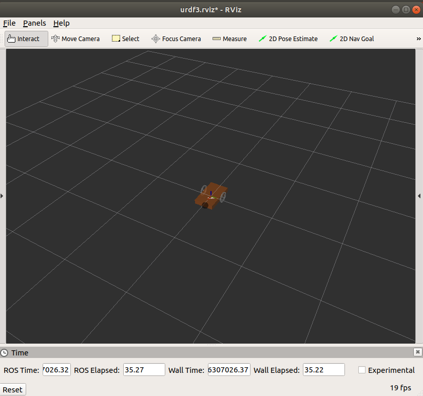
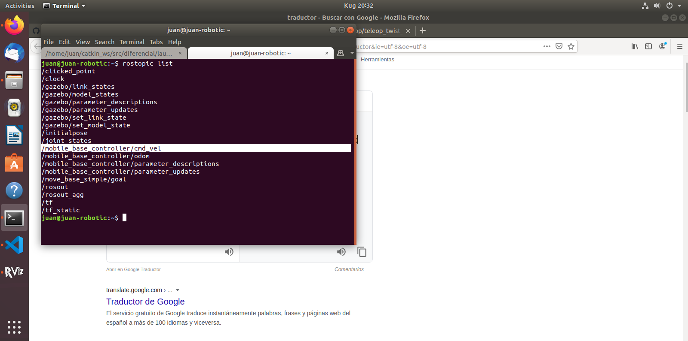
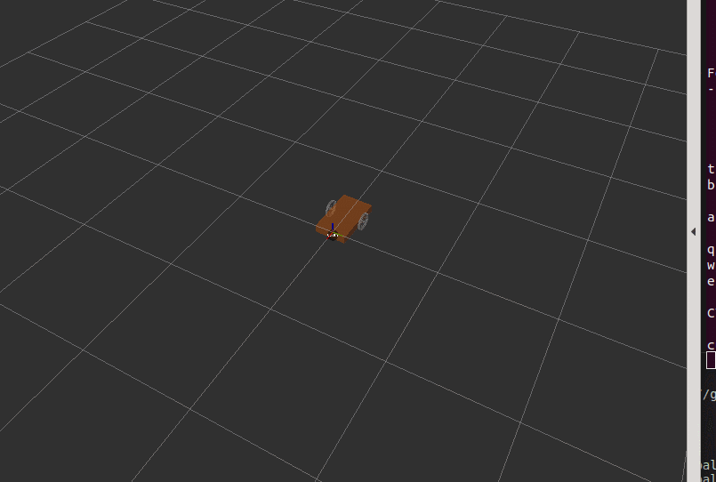
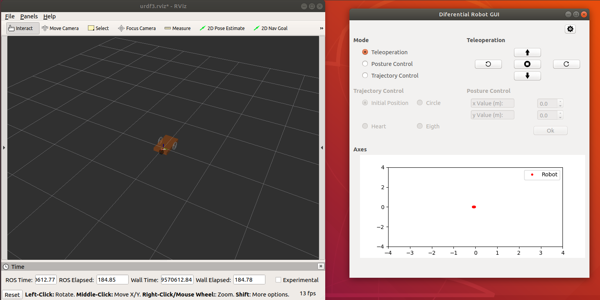

# GUI for a differential mobile robot

## 1. Contents

## 2. Prerequisites

Have ROS Melodic, QT Creator, PYQT4, gazebo control plugin, gazebo ros installed.

You have to have a catkin workspace.

Add the folder to your workspace.

## 3. Introduction

A GUI is performed in PYQT4 for the teleoperation and control of a simulated differential mobile robot in RVIZ using ROS.

## 4. RVIZ differential mobile robot

Use the follwing line in the terminal for view the robot created in RVIZ.

    roslaunch diferencial 01-diferencial.launch

When giving enter, the RVIZ must be displayed with the view of the robot as shown in the following figure:

This launch runs the JointState Controller, the Differential Drive ROS Controller, loads the URDF from the mobile robot and opens the RVIZ.

In order to better understand the use of the Differential Drive ROS Controller you can go to the following link:

<https://www.theconstructsim.com/ros-qa-126-how-to-configure-the-differential-drive-ros-controller/>

To test the operation of the system we are going to teleoperate the robot through the keyboard using the teleop_twist_keyboard which can be downloaded at the following link:

<https://github.com/ros-teleop/teleop_twist_keyboard>

Or using the following command:

    pip install teleop_twist_keyboard

To command the robot using the linear and angular speeds of the robot, a message must be posted to the topic /mobile_base_controller/cmd_vel as shown in the figure.

So we execute the teleoperation node through the following line in a new terminal:

    rosrun teleop_twist_keyboard teleop_twist_keyboard.py cmd_vel:=/mobile_base_controller/cmd_vel

It is observed how when giving the respective keys the robot in rviz begins to move.

## 5. GUI using PYQT4

In order to open the interface, it must be guaranteed to be in the following location in the terminal your_ws/src/ diferencial/src  and we run the program:

    python control_v2.py

The interface shown in the figure opens:

