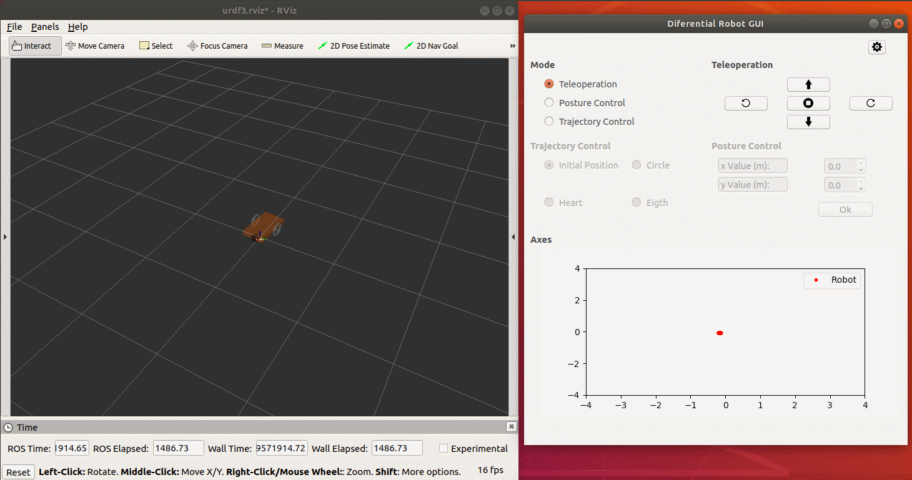
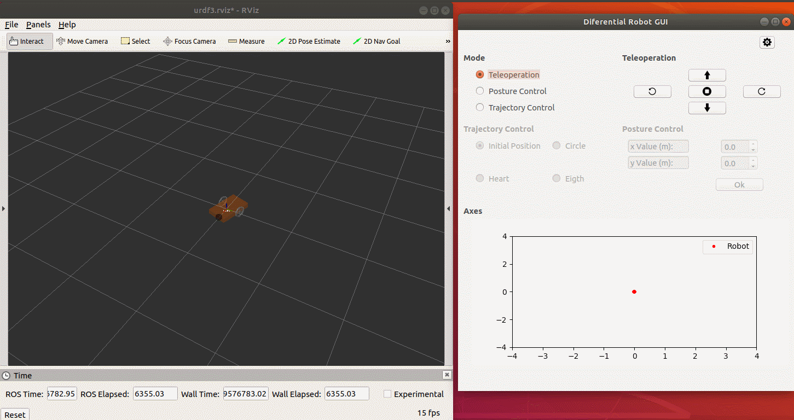
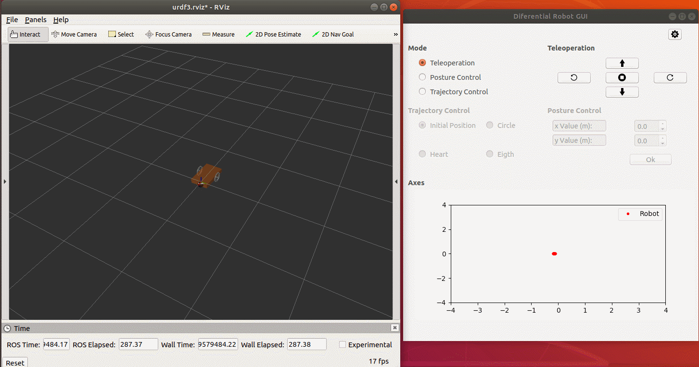
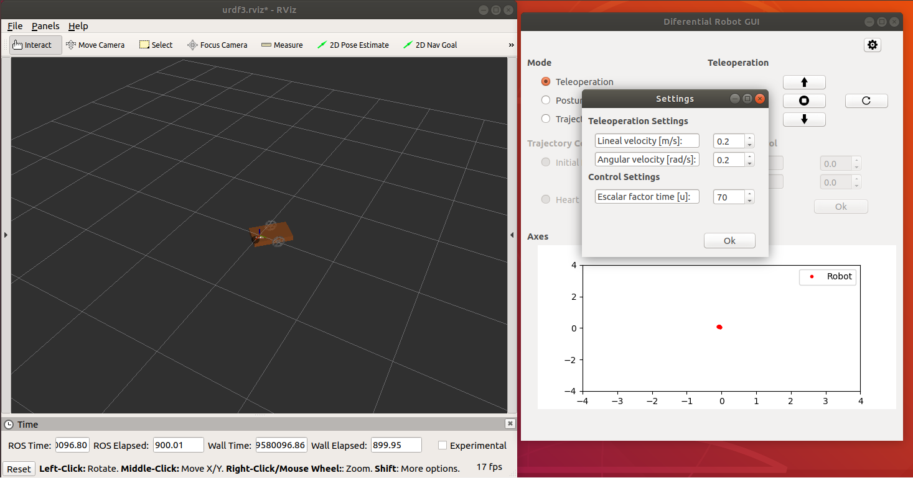

# GUI for a differential mobile robot
<!-- markdownlint-disable MD033 -->
## 1. Prerequisites

Have installed on your computer QT creator, PYQT4, ROS Melodic, ROS Melodic packages: gazebo ros plugin, gazebo ros.

Having created a catkin workspace.

## 2. Installation

Within the src folder of your workspace clone the repository, by using the following line:

    git clone https://github.com/Juanesb230/PYQT-RVIZ.git

Run the setup.bash to add the variables in linux environment with the following line:

    source ~/your_ws/devel/setup.bash

## 3. Description

The following GUI is performed in PYQT4 for the teleoperation and control of a simulated differential mobile robot in RVIZ using ROS.

## 4. RVIZ differential mobile robot

Use the following line in the terminal for view the robot created in RVIZ.

    roslaunch diferencial 01-diferencial.launch

The RVIZ must be displayed with the view of the robot as shown in the following figure:

  

This launch runs the JointState Controller, the Differential Drive ROS Controller, loads the URDF from the mobile robot and opens the RVIZ. Go to the following link for more information about the configuration of the Differential Drive ROS Controller.

<https://www.theconstructsim.com/ros-qa-126-how-to-configure-the-differential-drive-ros-controller/>

To probe the operation of the system, we are going to teleoperate the robot through the keyboard using the teleop_twist_keyboard which can be downloaded at the following link:

<https://github.com/ros-teleop/teleop_twist_keyboard>

Or using the following command:

    pip install teleop_twist_keyboard

The robot is teleoperated using the linear and angular speeds of the robot, so it is necesary to send the message in the topic:

    /mobile_base_controller/cmd_vel 

Then, execute the teleoperation node through the following line in a new terminal:

    rosrun teleop_twist_keyboard teleop_twist_keyboard.py cmd_vel:=/mobile_base_controller/cmd_vel

The robot starts to move when you press the letters: (I),(J),(K),(L),(;) of the keyboard.

  

## 5. Controller Interface using PYQT4

In order to open the interface, it must be guaranteed to be in the following location in the terminal:

    ~/your_ws/src/diferencial/src  

And run the program:

    python control_v2.py

The interface consists of three operating modes:

-Tele-operation

-Posture control

-Trajectory control

The following animation shows how tele-operation works.

For posture and trajectory control it was considered a PID cinematic controller.

The posture control is based on setting the position where you want the robot to go, as shown in the following animation:

Finally we have trajectory control, you can choose between this trajectories: an eight, a circle and a heart. As an example, in the next animation the robot makes a circle.

There is also a configuration window to set the robot speeds in tele-operation mode and set the speeds of the generated trajectories.

## 6. Contact with me

Linkedin: <www.linkedin.com/in/juan-balseca-pinto-9117b397>
